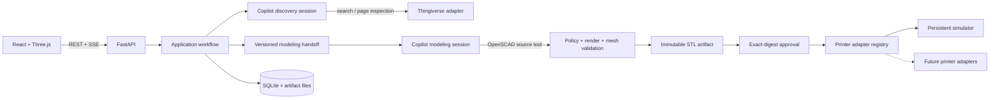

# 3D Printing Agent

A printer-neutral agent that turns a text requirement into an inspected, approved, and printable 3D model.

The system uses two isolated GitHub Copilot SDK sessions:

1. **Discovery** searches Thingiverse through constrained tools, inspects model-page text and creator gallery images, and selects a close model or decides to create one.
2. **Modeling** receives a validated, immutable handoff and creates or modifies OpenSCAD. It cannot search, access arbitrary files, or contact a printer.

Generated code is rendered and mesh-validated by application code. A user must inspect and approve the exact immutable artifact in the React/Three.js web interface before a printer adapter can submit it.

## Architecture



### Enforced boundaries

- Copilot receives only role-specific Pydantic tools; the SDK runs in `empty` mode without shell, generic filesystem, web, MCP, or printer tools.
- Thingiverse credentials remain in the server. They are not sent to gallery or download CDN hosts.
- Catalog content is treated as untrusted evidence. Search/inspection counts, image sizes, download sizes, hosts, and candidate identifiers are validated by server code.
- Discovery and modeling share no conversation history. Their only bridge is a schema-versioned, canonical-hash `ModelingHandoff`.
- OpenSCAD source can enter the system only through `submit_openscad_source`. Assistant prose is never adopted.
- OpenSCAD runs without a shell, in an isolated directory, with fixed arguments and a timeout.
- Final STL files must be parseable, finite, watertight, positive-volume, dimensionally valid, and within the target build volume.
- Approval binds to a manifest digest containing the exact source, STL, mesh report, provenance, workflow, and artifact version.
- Printer submission uses a stable idempotency key to prevent duplicate physical jobs.

## Workflow

1. The web app submits a text requirement and target printer.
2. The durable worker starts the discovery Copilot session.
3. Discovery calls `search_model_catalog` and `inspect_model_candidate`. It can refine the query over multiple rounds.
4. Candidate inspection uses the Thingiverse introduction, instructions, file list, attribution/license, popularity signals, and sanitized creator gallery images. The original STL is not downloaded during comparison.
5. Discovery selects an inspected model/file or creation from scratch.
6. A provisional source is downloaded and technically inspected. An invalid file returns the discovery session to search; an accepted one enters an immutable modeling handoff.
7. A separate modeling session submits complete OpenSCAD. Rejected source receives bounded renderer/mesh diagnostics and may be repaired within the attempt budget.
8. The Create page starts new workflows; the separate Models dashboard tracks every model and print.
9. The workflow interface displays the final STL, dimensions, mesh metrics, provenance, source, and artifact digest.
10. The dashboard lets the user edit the current model, search for a different base, make an independent copy, archive/restore it, or approve the exact artifact.
11. Approval does not print automatically. The user explicitly sends an approved artifact to the selected printer, and SSE reports status through completion.

## Requirements

- Python 3.11+
- Node.js 20+
- [OpenSCAD](https://openscad.org/) available on `PATH` or configured explicitly
- A GitHub account entitled to use Copilot
- A [Thingiverse developer token](https://www.thingiverse.com/developers)

## Setup

```powershell
py -3.12 -m venv .venv
.\.venv\Scripts\python -m pip install -e ".[dev]"
.\.venv\Scripts\python -m copilot download-runtime

Copy-Item .env.example .env
# Set PRINTING_AGENT_THINGIVERSE_TOKEN in .env

Set-Location web
npm.cmd install
npm.cmd run build
Set-Location ..
```

The Copilot SDK uses the currently signed-in Copilot CLI user by default. `PRINTING_AGENT_COPILOT_MODEL` can select a model; leaving it empty uses the SDK default.
The SDK command downloads and caches its matching Copilot runtime.

For a development frontend with hot reload:

```powershell
# Terminal 1
.\.venv\Scripts\printing-agent-api.exe

# Terminal 2
Set-Location web
npm.cmd run dev
```

Open <http://localhost:5173>. Vite proxies `/api` to FastAPI.

For a single local process, build the frontend and run:

```powershell
Set-Location web
npm.cmd run build
Set-Location ..
.\.venv\Scripts\printing-agent-api.exe
```

Open <http://127.0.0.1:8000>. FastAPI serves `web/dist` when present.

### Remote access

Keep FastAPI bound to `127.0.0.1`. Do not expose port 8000 to LAN or the internet.
Use the authenticated Caddy/Tailscale HTTPS deployment below for remote access.
Bambu account-session import, Studio launch/status, and credential removal are intentionally
unavailable through the reverse proxy.

## Windows deployment with Tailscale Funnel

The production-style Windows deployment keeps FastAPI and Caddy on loopback and uses
Tailscale Funnel as the only public ingress:

```text
Public HTTPS -> Tailscale Funnel -> 127.0.0.1:8080 Caddy Basic Auth
             -> 127.0.0.1:8000 FastAPI + React + durable worker
```

> [!WARNING]
> Funnel is public internet access. Anyone with the Basic Auth credentials can create
> Copilot workloads and approve print jobs. Use a unique password, rotate it if exposed,
> and reset Funnel immediately when public access is not required.

### Install

Run PowerShell as the Windows user whose Copilot credentials should be used:

```powershell
Set-ExecutionPolicy -Scope Process Bypass
.\deploy\windows\Install-Deployment.ps1
```

## Bambu Lab H2D printer-ready artifact slicing

This phase stops after creating a reviewed printer-ready artifact:

```text
verified model
→ versioned H2D slicing profile
→ read-only cloud H2D/AMS snapshot
→ reviewed material/tray/tool assignment
→ Bambu Studio CLI slicing
→ validated, reviewed, downloadable .gcode.3mf
```

Prerequisites:

1. Install the official Bambu Studio. The Windows installer script can install the
   WinGet package `Bambulab.Bambustudio`.
2. Configure these values in `.env` when auto-detection is insufficient:

```dotenv
PRINTING_AGENT_BAMBU_STUDIO_PATH=C:\Program Files\Bambu Studio\bambu-studio.exe
PRINTING_AGENT_BAMBU_STUDIO_RESOURCE_DIR=C:\Program Files\Bambu Studio\resources\profiles
# Optional when Studio uses a non-default per-user configuration directory:
PRINTING_AGENT_BAMBU_STUDIO_CONFIG_DIR=C:\Users\<user>\AppData\Roaming\BambuStudio
```

Use **Slicing profiles & cloud** in the WebUI to:

- review or clone the versioned built-in H2D slicing profile;
- configure nozzle, plate, and Bambu Studio profile mappings;
- connect a Bambu account from the server's localhost UI by opening official Bambu
  Studio, completing its phone/SMS or email sign-in, and explicitly importing the
  resulting local session;
- bind one cloud-observed H2D to a slicing profile;
- map cloud filament IDs to pinned local Bambu Studio filament profiles;
- forbid slots globally for automatic assignment.

Job creation supports stricter per-job slot restrictions and slicing overrides.
Forbidden slots are removed before the material-assignment agent receives candidates.

> [!WARNING]
> Bambu does not provide a supported public cloud inventory API. Official Bambu Studio
> performs account authentication; this optional, experimental provider imports its
> local signed-in session to read bound devices and AMS state. The application never
> handles the account password or SMS code. Session import is accepted only over
> localhost, and the access token is immediately stored with Windows DPAPI. Manual
> token entry remains available only as an advanced fallback.
> The provider can publish only the non-mutating `get_version` and `pushall` status
> requests. It cannot upload files, create cloud tasks, start/control a printer, or
> send arbitrary G-code.

FastAPI binds to `127.0.0.1`. Remote WebUI access goes through authenticated
Caddy/Tailscale HTTPS. Caddy denies Studio-session and credential-management paths,
so account connection must be performed directly at `http://127.0.0.1:8000`.

Cloud inventory is refreshed before material assignment and again before slicing.
Slicing blocks if the selected H2D is offline or its nozzle/AMS/material/quantity
state is incomplete or changed. Remaining grams are approximate:
`remain percentage × nominal tray weight`. The default safety margin is 15%.

The final screen provides the Bambu plate thumbnail, verified mappings, usage,
digests, manifest, and `.gcode.3mf` download. **No file is uploaded and no job is
submitted to a printer.** Printer submission is intentionally frozen for a future
design round.

The installer:

- installs Node.js LTS, OpenSCAD, Tailscale, and Caddy with WinGet when missing;
- creates `.venv`, installs Python and development dependencies, and downloads the
  matching Copilot runtime;
- builds `web\dist`;
- creates a protected `.env` and records the detected OpenSCAD path;
- prompts twice for a web password and stores only Caddy's password hash under
  `var\deployment`;
- registers and starts separate FastAPI and Caddy scheduled tasks at user logon; and
- configures persistent public HTTPS with Tailscale Funnel.

Before running the installer, sign in to Copilot CLI. Tailscale Funnel also requires a
signed-in Tailscale client, MagicDNS, tailnet HTTPS, and the `funnel` node attribute. The
first Funnel command may open the Tailscale approval page.

After installation, set the Thingiverse developer token in the protected `.env` file:

```text
PRINTING_AGENT_THINGIVERSE_TOKEN=<token>
```

Restart the application task after changing `.env`:

```powershell
Stop-ScheduledTask -TaskName "3D Printing Agent"
Start-ScheduledTask -TaskName "3D Printing Agent"
```

Use `-SkipPackageInstall`, `-SkipScheduledTasks`, or `-SkipFunnel` when provisioning
those layers separately. The scheduled tasks use the current user's profile and start
at logon, so the deployment is unavailable after a reboot until that user signs in.

### Operations

Inspect task state, local health, Basic Auth enforcement, and Funnel status:

```powershell
.\deploy\windows\Get-DeploymentStatus.ps1
```

Logs are written to `var\logs`. Caddy access logs rotate automatically. Back up the
SQLite database consistently together with immutable artifacts and simulator jobs:

```powershell
.\deploy\windows\Backup-Deployment.ps1
```

Backups are ZIP archives under `var\backups` and include a manifest of the effective
configured storage paths. To restore, stop both scheduled tasks, extract a backup, and
copy `printing-agent.db`, `artifacts`, and `simulator` to the corresponding
`PRINTING_AGENT_DATABASE_URL`, `PRINTING_AGENT_ARTIFACT_DIR`, and
`PRINTING_AGENT_SIMULATOR_SPOOL_DIR` destinations recorded in
`backup-manifest.json`. Then restart the tasks.

For an upgrade, back up first, update the checkout, then rerun
`Install-Deployment.ps1`; task registration and builds are idempotent. The installer
prompts for a new web password each time, which also rotates the credential.

Remove the scheduled tasks while retaining data, configuration, dependencies, and
backups:

```powershell
.\deploy\windows\Uninstall-Deployment.ps1 -ResetFunnel
```

Without `-ResetFunnel`, the public Funnel configuration is preserved. No router port
forwarding or inbound Windows Firewall rule is required or recommended.

## Configuration

All settings use the `PRINTING_AGENT_` prefix. See [`.env.example`](.env.example).

| Setting | Purpose |
|---|---|
| `THINGIVERSE_TOKEN` | Server-side Thingiverse API token |
| `OPENSCAD_PATH` | OpenSCAD executable path |
| `COPILOT_MODEL` | Optional Copilot model identifier |
| `DATABASE_URL` | SQLite database path |
| `ARTIFACT_DIR` | Immutable artifact storage |
| `CANDIDATE_CACHE_DIR` | Sanitized gallery and verified source cache |
| `SIMULATOR_SPOOL_DIR` | Persistent simulated printer jobs |
| `SEARCH_BUDGET` | Distinct searches per preparation cycle |
| `INSPECTION_BUDGET` | Candidate page inspections per cycle |
| `GENERATION_ATTEMPT_BUDGET` | OpenSCAD submissions per handoff |
| `CORS_ORIGINS` | Allowed development frontend origins |

## CLI

```powershell
printing-agent serve
printing-agent create "Create a 30 mm cable clip in PLA" --printer simulator
printing-agent get <workflow-id>
printing-agent approve <workflow-id> <artifact-version> <manifest-digest>
printing-agent print <workflow-id>
```

The web interface is the recommended client because it provides mandatory 3D inspection.

## HTTP API

| Method | Endpoint | Purpose |
|---|---|---|
| `POST` | `/api/v1/workflows` | Start model preparation |
| `GET` | `/api/v1/workflows` | List all workflows for the model dashboard |
| `GET` | `/api/v1/workflows/{id}` | Read workflow, artifact metadata, and print job |
| `GET` | `/api/v1/workflows/{id}/events` | Stream resumable SSE events |
| `GET` | `/api/v1/workflows/{id}/artifacts/{version}/model.stl` | Load the exact model |
| `GET` | `/api/v1/workflows/{id}/artifacts/{version}/source.scad` | Inspect adopted source |
| `GET` | `/api/v1/workflows/{id}/artifacts/{version}/manifest.json` | Inspect the artifact manifest |
| `POST` | `/api/v1/workflows/{id}/revisions` | Refine current model or search for a new base |
| `POST` | `/api/v1/workflows/{id}/approval` | Approve an exact artifact digest |
| `POST` | `/api/v1/workflows/{id}/print` | Send an approved artifact to the printer |
| `POST` | `/api/v1/workflows/{id}/copies` | Create an independent copy of an artifact |
| `POST` | `/api/v1/workflows/{id}/archive` | Hide a stable workflow while preserving files and history |
| `POST` | `/api/v1/workflows/{id}/restore` | Restore an archived workflow to normal dashboard views |
| `POST` | `/api/v1/workflows/{id}/cancel` | Cancel preparation or a supported print |
| `GET` | `/api/v1/printers` | List printer capabilities |

## Adding a printer adapter

Implement the `PrinterAdapter` protocol in `src/printing_agent/ports.py`:

```python
class MyPrinterAdapter:
    name = "my-printer"

    async def capabilities(self) -> PrinterCapabilitySummary: ...
    async def validate(self, artifact, settings) -> None: ...
    async def submit(self, workflow_id, artifact, settings, idempotency_key) -> PrintJob: ...
    async def status(self, external_id) -> PrintJob: ...
    async def cancel(self, external_id) -> PrintJob: ...
```

Register it in `build_container`. Slicing belongs inside the adapter (or a slicer composed by it), because printer families accept different formats and settings. The application core always supplies an approved, printer-neutral STL artifact plus print settings.

Use the simulator and its contract tests as the reference for persistence, idempotency, lifecycle statuses, validation, and cancellation.

## Adding a model catalog

Implement the `ModelCatalog` protocol and expose it through the existing discovery tools. The adapter must normalize provenance/license data and enforce its own host, token, download, and media policies. Copilot should never receive a generic HTTP tool.

## Validation

```powershell
.\.venv\Scripts\python -m ruff check src tests
.\.venv\Scripts\python -m pytest

Set-Location web
npm.cmd run lint
npm.cmd run build
```

Tests use fake renderers and mocked Thingiverse responses. Live Thingiverse/Copilot calls require credentials and are intentionally not part of the deterministic suite.

## Initial scope

- Thingiverse is the first catalog.
- The persistent simulator is the first printer adapter.
- Source creation/editing uses OpenSCAD and produces STL.
- One primary STL source file is supported per selected candidate.
- Browser-side mesh editing and learned mesh-similarity search are out of scope.
- The initial local deployment records a browser/CLI approver identity but does not implement multi-user authentication.
